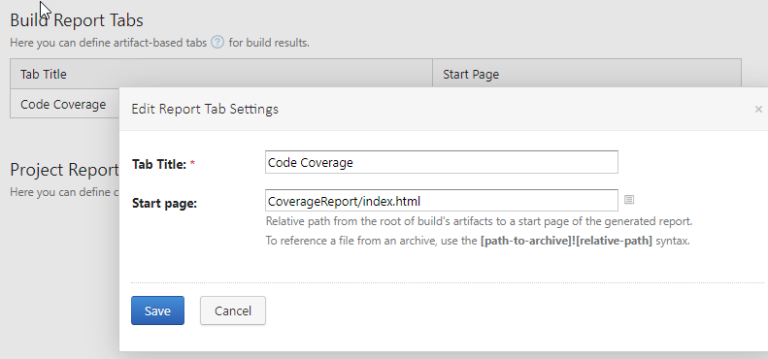
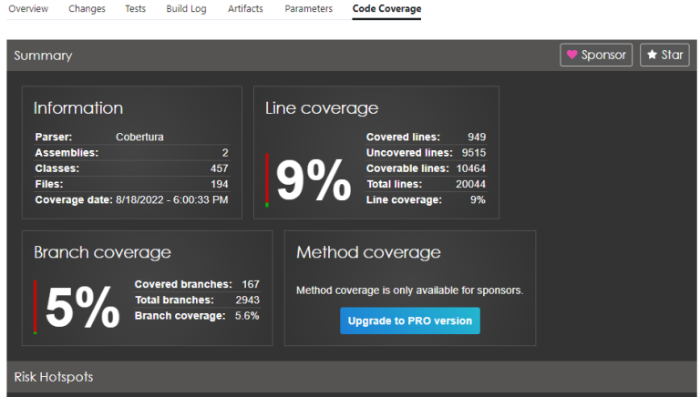

Many have tried generating Code Coverage metrics for .NET Framework applications, yet only few have succeeded. Even fewer choose to tell their story.

This is my success story.

You have a .NET Framework (let's go with 4.7+ at this point) application, maybe with pre-existing tests, maybe not. And, on top of that, you now want to get code coverage metrics.

After struggling with this on the [Visual Studio side of CodeStream recently](https://github.com/TeamCodeStream/codestream/commit/3a2eb2cdf6917193a5055c32b4c774d32aed42f5), I finally managed to get it working.  At a high level, let me outline what I had to do -

* Because I struggled with the initial tests written using [MSTest](https://docs.microsoft.com/en-us/dotnet/core/testing/unit-testing-with-mstest), I converted all the tests to [xUnit](https://xunit.net/) - some of this was out of sheer comfort with xUnit over MSTest, but also because its OSS product under the .NET Foundation - and I like supporting those
* Reference a couple NuGet packages for executing tests at a command prompt
* Utilize [Coverlet](https://github.com/coverlet-coverage/coverlet) and [Report Generator](https://reportgenerator.io/) utilities - however, this is where its funny, because these are [.NET CLI Tools](https://docs.microsoft.com/en-us/dotnet/core/tools/global-tools) that need the .NET 6 SDK installed.
* Run the tests during CI, and publish the results (we're using TeamCity, so you might need a different variation of what I did to accomplish this for yourself)

Let's dive into each of those for some greater detail, shall we?

##### Migration to xUnit

Like I said, this is mostly preference, and what I lay out in further steps might still work fine. I'll call out the differences when we get there.

##### NuGet Package References

I know I mentioned we are using xUnit as our testing framework (which is available as a NuGet package), but we also need a couple extra packages to seal the eventual deal. These are all installed into the testing project -

* `xunit.runner.console` - This will be the utility we execute to run the tests on the CI server
* `xunit.runner.visualstudio` - I want to be able to run my tests from within VS, so we need this to bridge the gap there.
* `Microsoft.NET.Test.Sdk` - This is needed to go along with the xunit visual studio runner mentioned above

##### .NET Tools

This is where it got confusing - but it does work, so stick with me. Most every single tool, or guide around testing / code coverage / etc. (for .NET anyway), have really bought into the .NET CLI tool structure. And you might be thinking, wait, my product is using .NET Framework, I can't use .NET 6 CLI tools!  Yes you can!  The execution of the tests and the generating of the coverage report (and the version of .NET) they were written with, don't matter in this case.

First, you'll need to [install the .NET 6 SDK](https://dotnet.microsoft.com/en-us/download/dotnet/6.0) from Microsoft on your build server if you haven't already.

Now, from a command-line (locally), sitting in the folder of the project that houses your tests, execute the following command -

```shell
dotnet new tool-manifest
```

This will create a `.config` folder with a `dotnet-tools.json` file instead.

Now, install the two utilities mentioned above -

```shell
dotnet tool install coverlet.console
dotnet tool install dotnet-reportgenerator-globaltool
```

If all succeeds, these two tools should now be installed as "local tools", and the manifest created in the previous step updated to reflect them. Yours should end up looking something like this (though version numbers may differ) -

```json
{
  "version": 1,
  "isRoot": true,
  "tools": {
    "coverlet.console": {
      "version": "3.1.2",
      "commands": [
        "coverlet"
      ]
    },
    "dotnet-reportgenerator-globaltool": {
      "version": "5.1.9",
      "commands": [
        "reportgenerator"
      ]
    }
  }
}
```

Commit the new file to version control, we're going to need it available on the CI server for our next step.

##### Modify CI Server Process

During your build process, wherever you want to run the tests and generate the report, will need a couple modifications.

First, we need to get those two tools installed on the CI server. Since they're just local tools and we have the manifest, we can execute a command from the shell of your choice (the directory for this example was set to the same testing folder we used when we installed the tools originally) -

```shell
dotnet tool restore --tool-manifest "./.config/dotnet-tools.json"
```

Now we need to execute the tests, and this is where it got a smidge confusing. We need to execute the tests using our xUnit console runner, but also use Coverlet to generate a "report" (flat file, not pretty / useful for viewing).

Here's where I ultimately landed -

```shell
dotnet coverlet "CodeStream.VisualStudio.UnitTests.dll" --target "$xunit" --targetargs "CodeStream.VisualStudio.UnitTests.dll" --format cobertura
```

Replace `$xunit` in the sample with the fully-qualified path to the xUnit console runner, which will be located in your NuGet packages. On our CI server, NuGet packages are restored to `C:\.nuget`, so for me, this path was `C:/.nuget/xunit.runner.console/2.4.2/tools/net472/xunit.console.x86.exe` (again, yours may differ depending on versions)

What is this doing? Well, its using the coverlet console utility (invoked via the `dotnet` command), wrapping the execution of the test suite via xUnit, then producing a report in a specific format called `cobertura`.

`-target` and `-targetargs` are to specify the xUnit executable and IT'S parameters for execution (which you can find on the xUnit website, but expanded out and ran separately, would look like this (given my current directory is the output directory for the testing assembly) -

```shell
C:/.nuget/xunit.runner.console/2.4.2/tools/net472/xunit.console.x86.exe CodeStream.VisualStudio.UnitTests.dll
```

We're just wrapping it all up inside of coverlet so we can run the tests and generate that cobertura report.

Now, that cobertura report isn't useful (to me) by itself.  So one more thing we can add is to create a nice HTML page from it, using the Report Generator utility.
Running the following command (again, given the currently directory is the output directory for the testing assembly) against the cobertura report from the previous step, will generate a new folder "coveragereport" that houses all the HTML, CSS, JS, etc.

```shell
dotnet reportgenerator "-reports:coverage.cobertura.xml" "-targetdir:coveragereport" "-reporttypes:Html;TeamCitySummary"
```

That's the pipeline, basically, but now you need to publish the coveragereport files to your CI server, so you can actually glean useful information from it.

In TeamCity, you need to -

* Save that entire `coveragereport` folder as a build artifact
* Create a custom "Report" tab for the build project and "point" it to the `index.html` file inside of that folder/artifact

If your build artifact is the folder and its contents, you would create a report tab with the following properties -



With any luck, running the build will result in the build details having a few new tabs across the top -



First is the "Tests" tab, which just outlines all the individual tests that were ran, and what their status was. I won't show you that one, its kinda boring 😉.

Second is this amazing "Code Coverage" tab. And, yes, I know those numbers suck, but we're getting there. Before progress can be made, I need data to confirm the starting point

Now, how do you publish that `coveragereport` folder and display it on other CI systems(GitHub Actions, Azure Pipelines, etc.)? I cannot say.

What I can say, however, is that just *getting* to the point of having that `coveragereport` folder being generated was an uphill battle of epic proportions and I survived to tell the tale.

If you made it this far, thank you, dear reader, I appreciate you. If you attempt to follow this post as a guide and run into any issues, feel free to let me know. If you find errors in this guide, please let me know.
