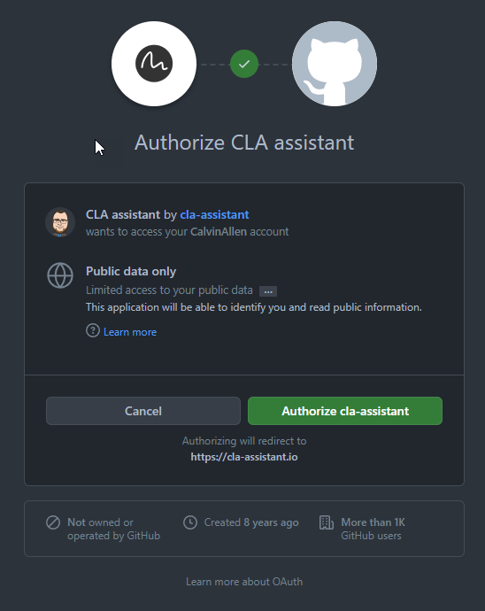
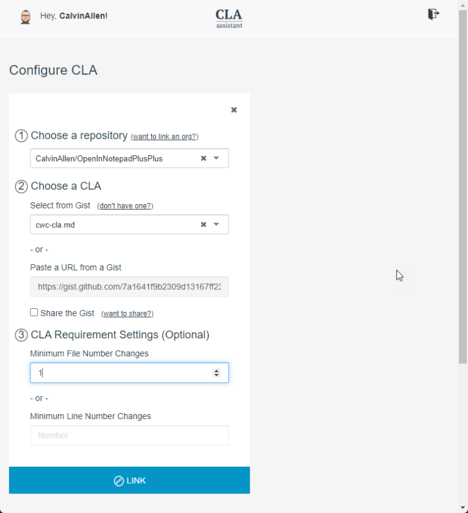
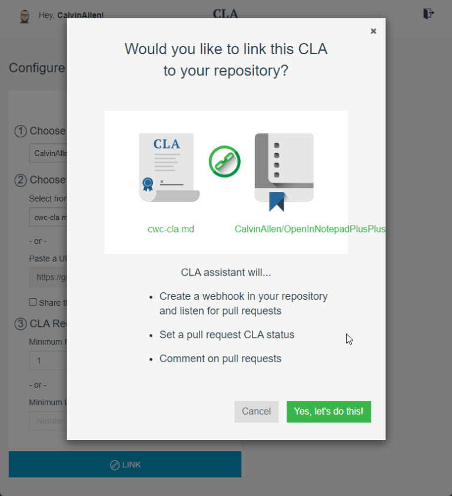
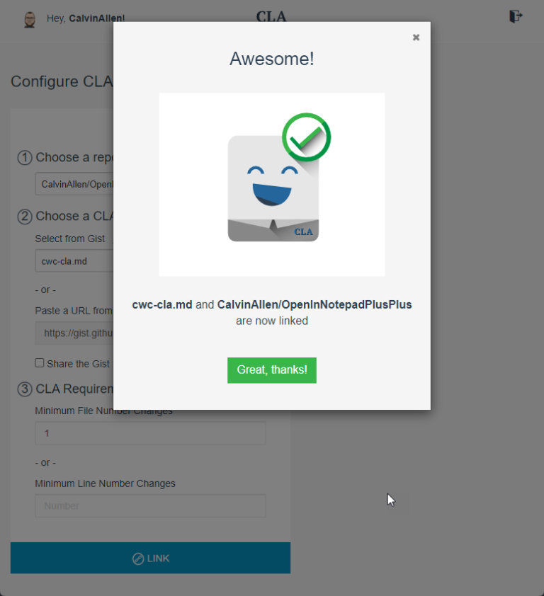
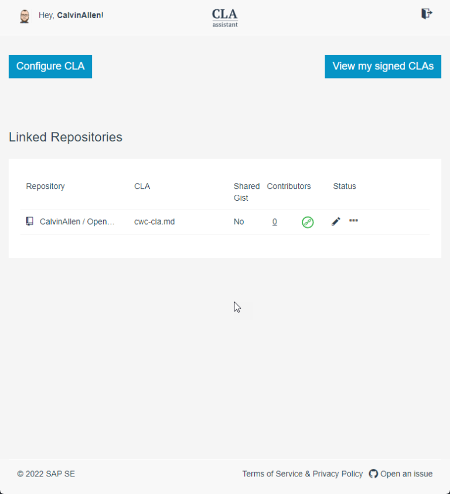
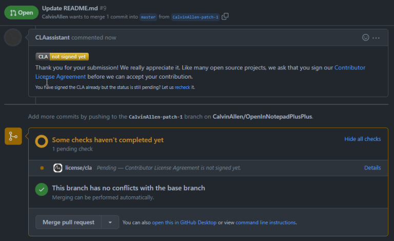
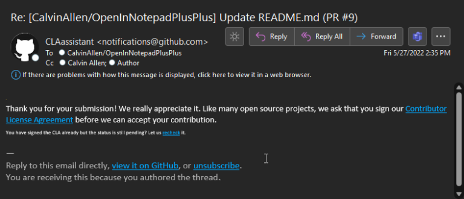
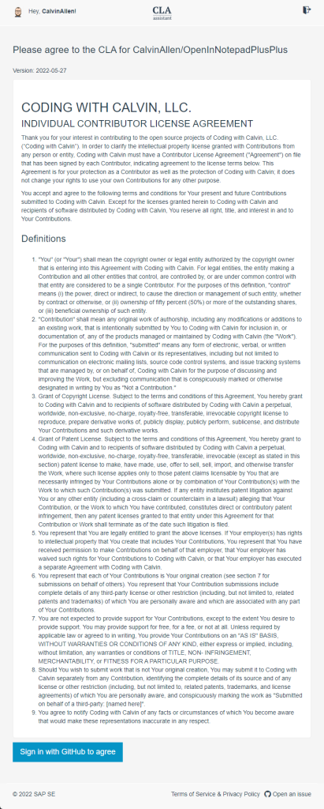

Today, I spent a little bit of time figuring out how to get a proper CLA bot attached to some GitHub repositories. Gotta tell ya, it wasn't that hard, but I wanted to blog it anyway so I can refer back when I have to do it again in 5 years. Here we go.

We utilized "CLA Assistant" ([https://cla-assistant.io/](https://cla-assistant.io/)), a free service that handles just about everything automatically - but there is a bit of setup, so let's talk through that.

CLA Assistant requires you to sign in with GitHub (makes sense), have a gist that contains the agreement text, and then you can configure it for an entire organization, or individual repositories. It does require access to those items, of course, and will end up creating webhooks in either of those locations.

### Step 1

Create a private (or public) gist, using markdown, and configure the body of the text to be the licensing agreement text you wish folks to read and accept, during a PR workflow.  As an example, [here is my gist of a "Coding with Calvin" CLA](https://gist.github.com/CalvinAllen/7a1641f9b2309d13167ff23d57ff7245).

### Step 2

Log into CLA Assistant using your GitHub credentials and authorize it to access your account / data -

Then, CLA Assistant will request additional permissions, which you can see here -

As you can see, it requests a number of scopes, and allows you to grant/request access to any organizations you are part of. In my case, it's already approved for **TeamCodeStream**, and I only wish to grant access to **my** repositories at this time for demo purposes.

### Step 3 - Configure a CLA for a Repository

At this point, you should be looking at the "Dashboard" for CLA Assistant -

Click the "Configure CLA" button in the upper left corner to launch the configuration dialog -

* Choose a repository from the first dropdown that you wish CLA Assistant to manage
* Choose your CLA - if you followed my steps, you already configured your gist, and just need to select it from the list. If not, you need to create one now.
* Set the minimum number of files, or lines, that will require a CLA - in our case, we set files to 1 so that any change to any file will require it.
* Finally, click the Link button

CLA Assistant will show another dialog, requesting you to "confirm" the new link -

Click, "Yes, let's do this!", and after a moment, you will receive a confirmation dialog -

Clicking, "Great, thanks!" will close the dialog and refresh the dashboard to show your new link -

### Step 4

Your configuration is done, now just sit back and wait for a PR to come through.

Anyone that submits a PR that has NOT signed the CLA will be prompted within the PR like so -

They will also receive an email -

The contributor can click the "Contributor License Agreement" link, or the "Details" link in the pending check section to be taken to the actual CLA to sign-

The contributor can then "sign in with GitHub to agree", and once completed, they will be redirected back to the open PR - but now everything is good to go!

At any point, you can log back into CLA Assistant and perform a variety of actions, such as:

* View everyone who has signed
* Make changes to the link, including adding specific GitHub usernames to *IGNORE* for the CLA check (good within organizations)
* View/revoke **your own** signed CLAs
* Recheck all open PR's (this is good if you already have open PR's that you want to go through this process)

Also, as a note on "versioning", updating the underlying gist will cause the CLA to be revised and any old signatories/contributors will need to sign the **new version** for any new PRs they submit.

Quite a wonderful thing, and I hope this helps someone! Thanks for reading, friends!
