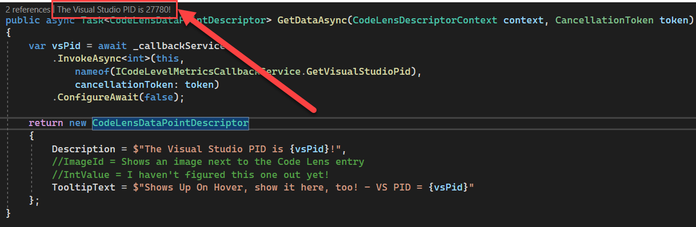

> Check out the other posts in this series!
>
> 1. [Extending Visual Studio CodeLens Functionality](https://codingwithcalvin.net/extending-visual-studio-codelens-functionality/)
> 1. **YOU ARE HERE!**
> 1. _Coming Soon!_

If you remember Part I of this blog post series (which was only 8 months ago - sorry about that 😬), you'll know that in _THIS_ post, we're going to talk about how you can make calls back into services in your extension host _FROM_ the CodeLens provider.

Since the CodeLens provider / service runs out of process from your main extension, its hard to get back to some of the goodness you've already built out there - like services, commands, etc. But, fear not, with a couple interfaces and some MEF injection, we can make it all work!

Let's start with a base request of getting the Visual Studio process ID _FROM_ the CodeLens provider. Now, since the CodeLens provider runs out of process from your extension, that means it also runs out of process from Visual Studio, too, which means we can't access it directly from our provider.

The first thing you'll want to do is add a constructor to your `CodeLevelMetricsProvider` class that we created in Part I of this series, and have it set to be the `ImportingConstructor` for MEF -

```csharp
[ImportingConstructor]
public CodeLevelMetricsProvider() {
}
```

Now, we need to add a parameter to the constructor and store it in a private field -

```csharp
private readonly Lazy<ICodeLensCallbackService> _callbackService;

[ImportingConstructor]
public CodeLevelMetricsProvider(Lazy<ICodeLensCallbackService> callbackService) {
    _callbackService = callbackService;
}
```

`Lazy` is just a way to provide lazy initialization, and the `ICodeLensCallbackService` is a special interface from the `Microsoft.VisualStudio.Language.CodeLens.Remoting` namespace (so you'll need to add that if you're getting errors).

Now, in your main extension, we're going to create a new 'service'. I called mine `CodeLevelMetricsCallbackService`. Let's start by having it -

1. Bring in the `Microsoft.VisualStudio.Language.CodeLens` namespace
1. Implement the `ICodeLensCallbackListener`
1. Export as Shared with MEF -

```csharp
using Microsoft.VisualStudio.Language.CodeLens;

namespace CodeLensServices { // Whatever your ACTUAL namespace is can go here :)
    [Export(typeof(ICodeLensCallbackListener))]
    [PartCreationPolicy(CreationPolicy.Shared)]
    [ContentType("CSharp")]
    public class CodeLevelMetricsCallbackService : ICodeLensCallbackListener     {
    }
}
```

This next part isn't REQUIRED, but I think it helps to clean up some "magic strings" that may appear otherwise. Let's create a new interface for our specific purposes -

```csharp
public interface ICodeLevelMetricsCallbackService {

}
```

And since we know we're trying to get the Visual Studio process ID, lets declare that desire in this interface -

```csharp
public interface ICodeLevelMetricsCallbackService{
    int GetVisualStudioPid();
}
```

Armed with this new interface, let's go back to our `CodeLensService` and implement this interface as well, which would look something like this -

```csharp
using Microsoft.VisualStudio.Language.CodeLens;

namespace CodeLensServices {// Whatever your ACTUAL namespace is can go here :)
    [Export(typeof(ICodeLensCallbackListener))]
    [PartCreationPolicy(CreationPolicy.Shared)]
    [ContentType("CSharp")]
    public class CodeLevelMetricsCallbackService : ICodeLensCallbackListener, ICodeLevelMetricsCallbackService    {
        public int GetVisualStudioPid() {
            return Process.GetCurrentProcess().Id;
        }
    }
}
```

It should be noted that if you want to reuse a service you've already defined -

1. Inject it into the constructor
1. Call the appropriate method in _THAT_ service from a method in _THIS_ class

Alright, we're ready to add the magic to the CodeLens provider! Let's pass our service down to the data point from the `CreateDataPointAsync` method -

```csharp
public async Task<IAsyncCodeLensDataPoint> CreateDataPointAsync(CodeLensDescriptor descriptor, CodeLensDescriptorContext context, CancellationToken token) {
    return new CodeLensDataPoint(descriptor, _callbackService.Value);
}
```

That `_callbackService.Value` does the lazy loading of the service now that we're actually trying to use it.

Now we can modify our datapoint to take the new constructor parameter, and wire it all up!

```csharp
public class CodeLensDataPoint : IAsyncCodeLensDataPoint {
    private readonly ICodeLensCallbackService _callbackService;

    public CodeLensDataPoint(CodeLensDescriptor descriptor, ICodeLensCallbackService callbackService) {
        _callbackService = callbackService;
        Descriptor = descriptor;
    }

    public Task<CodeLensDataPointDescriptor> GetDataAsync(CodeLensDescriptorContext descriptorContext, CancellationToken token) {
        var vsPid = await _callbackService
            .InvokeAsync<int>(this,
                nameof(ICodeLevelMetricsCallbackService.GetVisualStudioPid),
                cancellationToken: token)
            .ConfigureAwait(false);

        return new CodeLensDataPointDescriptor {
            Description = $"The Visual Studio PID is {vsPid}!",
            //ImageId = Shows an image next to the Code Lens entry
            //IntValue = I haven't figured this one out yet!
            TooltipText = $"Shows Up On Hover, show it here, too! - VS PID = {vsPid}"
        };
    }

    public Task<CodeLensDetailsDescriptor> GetDetailsAsync(CodeLensDescriptorContext descriptorContext, CancellationToken token) {
        // this is what gets triggered when you click a Code Lens entry, and we don't really care about this part for now
        return Task.FromResult<CodeLensDetailsDescriptor>(null);
    }

    public CodeLensDescriptor Descriptor { get; }
    public event AsyncEventHandler InvalidatedAsync;
}
```

Notice that we only made a few changes to this class (started with the final result from Part I of the series) -

1. Modified the constructor to accept the ICodeLensCallbackService, and stored it off for use later
1. When we actually want to RENDER the CodeLens, we make a call through that service to the method we created to retrieve the PID
1. Pass the PID we received into the Description of the CodeLens so it'll show up!

Let's talk about that method call we added, because thats the fun part of all this. As long as you set up the interfaces correctly, Visual Studio will actually handle all the actual communication for you through calls using `InvokeAsync`, which just uses RPC "under the hood".

```csharp
var vsPid = await _callbackService
    .InvokeAsync<int>(this,
        nameof(ICodeLevelMetricsCallbackService.GetVisualStudioPid),
        cancellationToken: token)
    .ConfigureAwait(false);
```

1. The initial method call here is really just like any other async method you may call - await it, invoke it, and (optionally) configure it.
1. `InvokeAsync` is generic and requires you to specify a few things -
   a. `int` - The return value type (What is `GetVisualStudioPid` returning from our extension service?)
   a. `this` - We need to specify the 'owner', which in this case is the datapoint itself.
   a. `nameof(ICodeLevelMetricsCallbackService.GetVisualStudioPid)` - I like using `nameof()` in this case for those scenarios where you may have magic strings show up. This is basically why we created that secondary interface. Technically optional, but then you would need to pass `"GetVisualStudioPid"` in place of `nameof()` here instead. Blah.
1. Since its async, need a `cancellationToken`

If you run your application, you should see a fancy new CodeLens entry that reports the process ID of Visual Studio!

First, what I call "inline" CodeLens -



Secondly, the "hover" state -


Now, before we go, I do want to note a couple other variations of `InvokeAsync` that you can use if need be.

First - you can _absolutely_ pass arguments back up through these `InvokeAsync` calls. That would look something like this -

```csharp
var returnVal = _callbackService.Value
    .InvokeAsync<int>(this,
        nameof(ICodeLevelMetricsCallbackService.MeaningOfLife),
        new[] { 42 },    // arguments here - just an array of objects
        cancellationToken: token)
    .ConfigureAwait(false);
```

That would correspond to a method signature of -

```csharp
public int MeaningOfLife(int meaningOfLife) {
    return meaningOfLife;
}
```

I'll also note that the array of arguments needs to be passed in the same order as the parameters to the method and types must match. I don't, however, see any requirement that the **NAMES** match.

Secondly, is that you can call methods that are just void return types, which would look something like this -

```csharp
_ = _callbackService.Value
    .InvokeAsync(this,
        nameof(ICodeLevelMetricsCallbackService.BurnItDown),
        cancellationToken: token)
    .ConfigureAwait(false);
```

And that would coorespond to a method signature of -

```csharp
public void BurnItDown() {
    Process.GetCurrentProcess().Kill();
}
```

Of course, you can combine any combination of return types, parameters, etc as you need.

---

There you go dear readers! One-way communication from your out-of-process CodeLens provider _BACK_ into your extension! Up next will be the final post in this series where we discuss how to setup TWO-WAY communication - useful for forcing your CodeLens to refresh for some reason, like an event that happened in your main extension.

Stay tuned!
