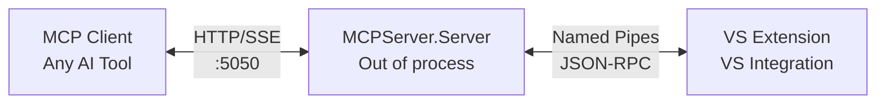

JetBrains is shipping MCP servers for their IDEs. Visual Studio isn't.

So I wrote one.

## VS MCP Server

**VS MCP Server** exposes Visual Studio features as [MCP](https://modelcontextprotocol.io/) tools. Once connected, an AI assistant can:

- Get information about your currently open solution and projects
- Open, close, read, and write documents
- Work with text selections and navigate the editor
- Trigger builds and check build status

All through the MCP protocol. It doesn't matter if you're using Claude Desktop, Cursor, Windsurf, or any other MCP-compatible client - they all speak the same language.

## The Architecture

Visual Studio extensions run on the UI thread, and blocking that is a recipe for a sluggish IDE. An MCP server needs to handle HTTP connections and process requests, so doing all that on the main thread wasn't going to work.

The solution was to split things up. The extension spawns a separate process to handle HTTP/SSE communication with MCP clients. That process talks back to the Visual Studio extension via named pipes using JSON-RPC. Visual Studio stays responsive, the MCP server handles requests without blocking anything.

## Getting Started

The extension is available on the [Visual Studio Marketplace](https://marketplace.visualstudio.com/items?itemName=CodingWithCalvin.VS-MCPServer). Install it, configure settings at **Tools > Options > MCP Server** if needed, then start the server via **Tools > MCP Server > Start Server** (or enable auto-start).

From there, configure your MCP client to connect to `http://localhost:5050/sse`. The extension supports Visual Studio 2022 and 2026, on both ARM64 and AMD64.

For the full list of available tools and configuration options, check out the [GitHub repo](https://github.com/CodingWithCalvin/VS-MCPServer).

## What's Next

The current toolset covers the basics - solutions, documents, editor operations, and builds. But there's a lot more potential here. I'm planning to integrate Roslyn to enable deeper code exploration capabilities. Imagine asking your AI assistant to find all usages of a method, or get the signature of a class, or navigate through the semantic model of your code. That's where things get really interesting.

## Wrapping Up

This is a new project, and I'm still finding the rough edges. If you run into issues or have ideas for additional tools, let me know. The source is on [GitHub](https://github.com/CodingWithCalvin/VS-MCPServer), and as always, I'm open to feedback and contributions.

Thanks for reading!
