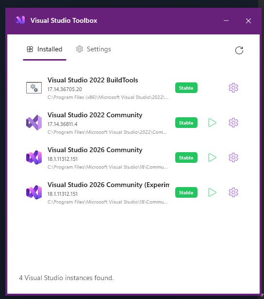
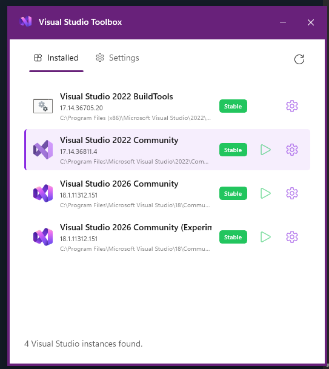
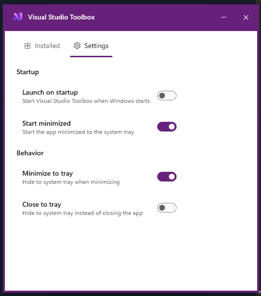

If you've ever used JetBrains Toolbox, you know how convenient it is. It's the central hub for all your JetBrains IDEs — install new tools, manage updates, launch any version with a single click. Everything in one place, tucked away in the system tray.

The other day I was clicking around in JetBrains Toolbox and it hit me — why doesn't Visual Studio have something like this? I've got multiple versions installed, experimental hives for extension development, and I'm constantly hunting through the Start menu to find the right one. Turns out this was exactly what I needed but didn't know I wanted.

So I built it.

## Introducing Visual Studio Toolbox

Visual Studio Toolbox is a Windows system tray application that serves as mission control for Visual Studio. It automatically detects all your Visual Studio installations — 2019, 2022, 2026, experimental hives, the whole lot — and puts them one click away.

No more hunting through the Start menu. No more trying to remember which version you need for that legacy project. Just click the tray icon and pick the one you want.

## What Can It Do?

Here's the quick rundown of features:

### One-Click Launch

Each Visual Studio instance in the list has a play button right there — click it and that version launches. That's it. That's the whole thing.

### Developer Tools at Your Fingertips

Click the gear icon on any instance and you get quick access to:

- **Developer Command Prompt** — because sometimes you just need that environment
- **Developer PowerShell** — same deal, but PowerShell flavored
- **Open Installation Folder** — jump straight to where VS lives on disk
- **Open AppData Folder** — for when you need to poke around in settings and extensions

The list of command prompt and PowerShell options is driven by your Windows Terminal profiles. If you've got custom profiles set up, they'll show up here. If you don't have Windows Terminal installed or don't have any profiles, it falls back to a single Developer Command Prompt and single Developer PowerShell option.

### Stays Out of Your Way

The app lives in your system tray. You can configure it to:

- Launch on Windows startup
- Start minimized
- Minimize to tray instead of taskbar
- Close to tray (so it's always ready when you need it)

## The Tech Stack

For those curious about what's under the hood:

- **C# 13** and **.NET 10**
- **WinUI 3** with **Windows App SDK 1.8**
- **H.NotifyIcon.WinUI** for the system tray functionality
- **MVVM Community Toolkit** for keeping things clean and testable

I wanted to build this with modern Windows development tech, and WinUI 3 gave me exactly what I needed — a native Windows look and feel with proper light/dark theme support (complete with that sweet Visual Studio purple accent color).

Getting the window styled the way I wanted took some effort though. I was going for a specific look — no traditional Windows chrome, square borders, a flat aesthetic. WinUI 3 doesn't make that trivial out of the box, but after some wrestling with window customization APIs, I got it where I wanted it.

## Get It / Contribute

Visual Studio Toolbox is open source under the MIT license. Grab a portable executable from the GitHub releases, or check out the source:

👉 [github.com/CodingWithCalvin/VSToolbox](https://github.com/CodingWithCalvin/VSToolbox)

Eventually there will be an MSIX package on the Microsoft Store — when I have time to figure that whole process out.

This is still early days — version 0.1.1 just shipped — so there's plenty of room for new features and improvements. If you've got ideas or run into issues, let me know!

As always, I accept pull requests :)

