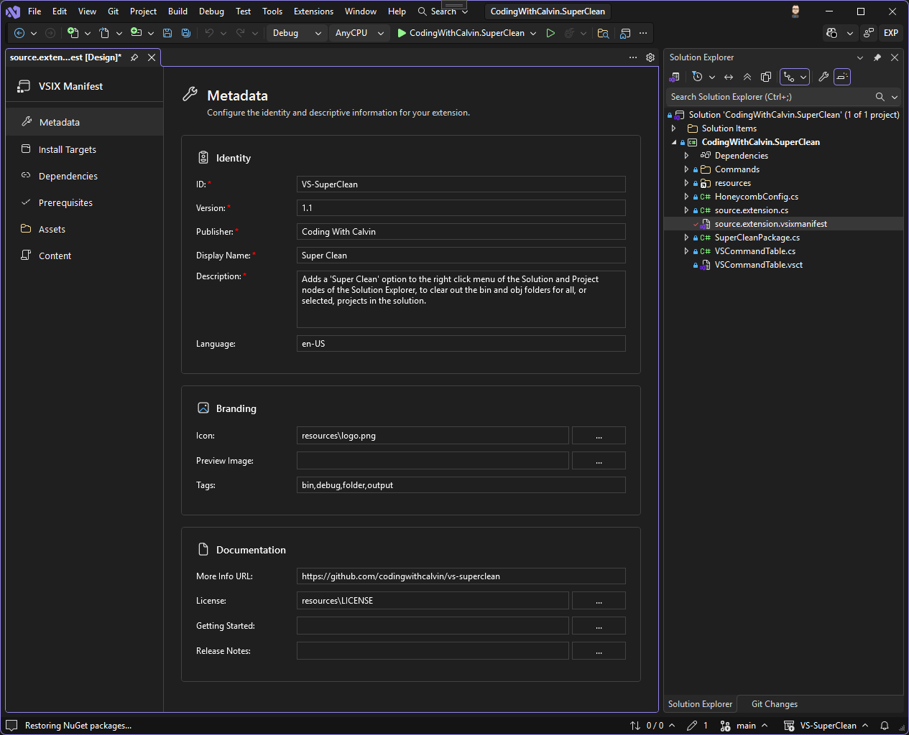
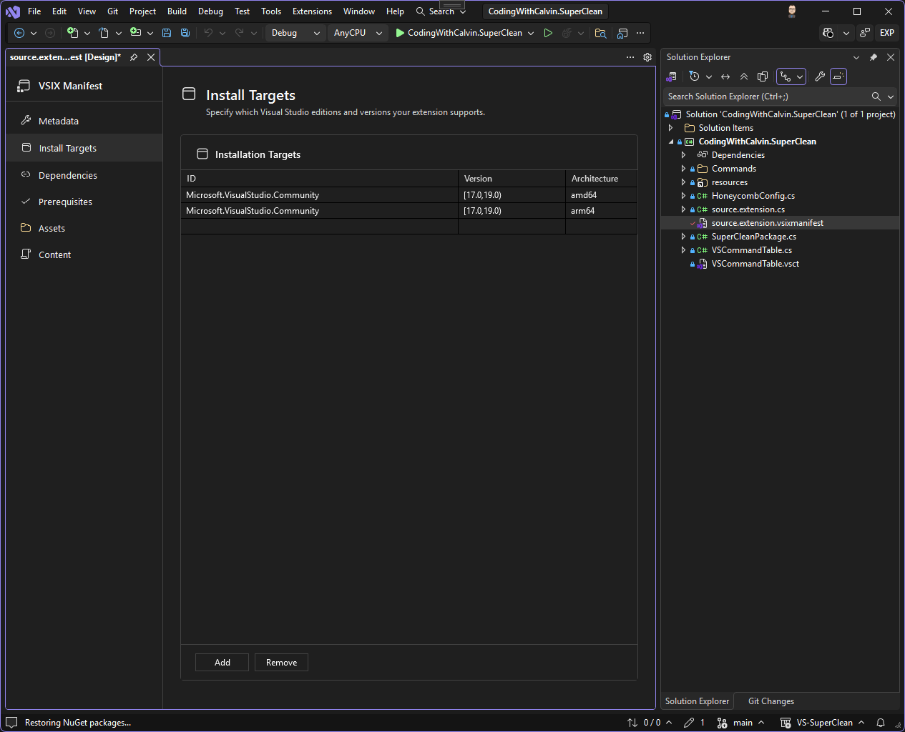
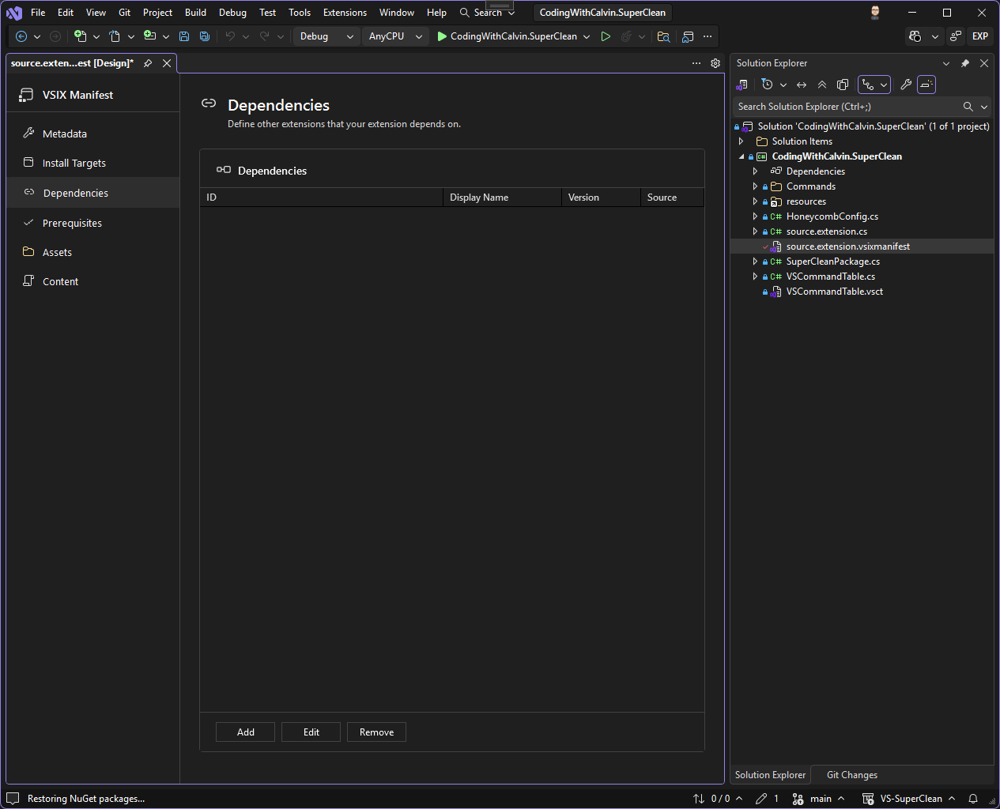
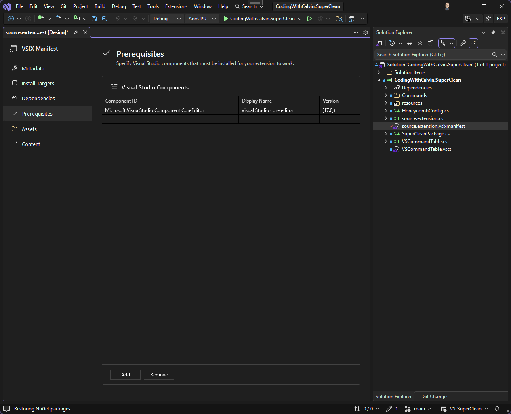
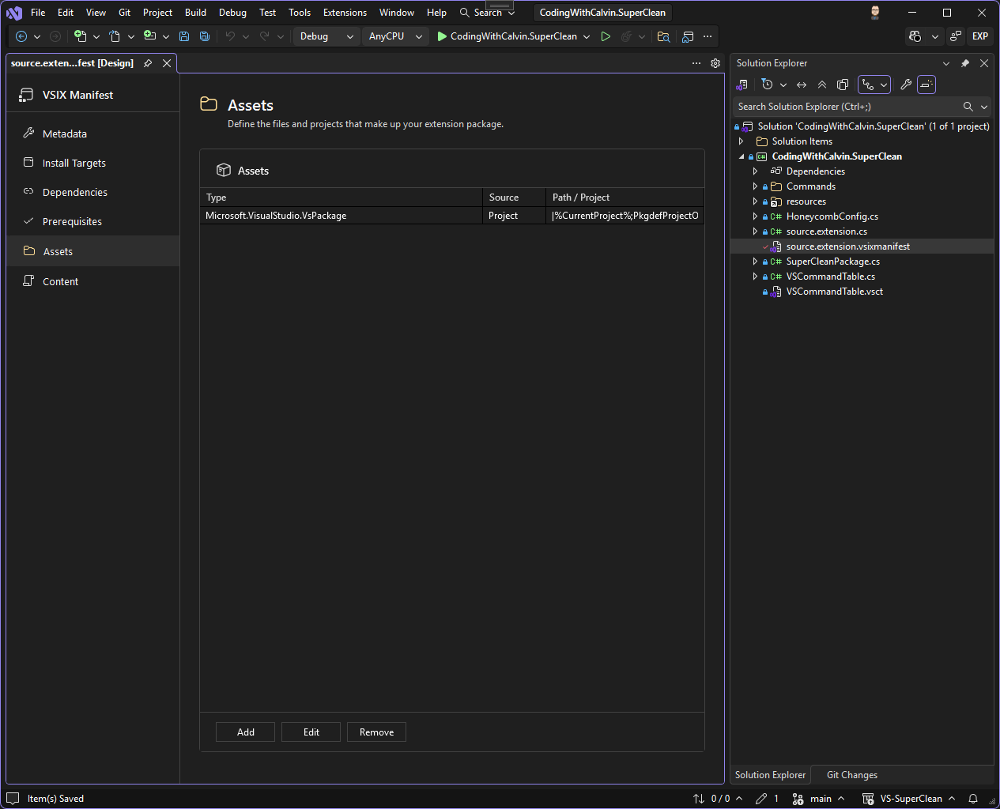
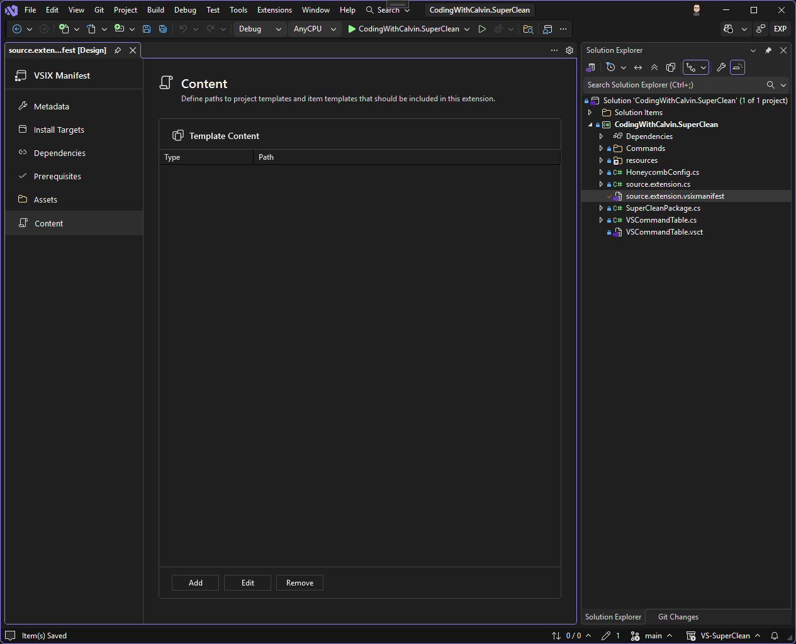

I'll be honest - I've been building Visual Studio extensions for years now, and one thing that has always bugged me is editing the `source.extension.vsixmanifest` file. Sure, Visual Studio has a built-in designer, but let's just say it hasn't aged gracefully. It feels clunky, looks outdated, and doesn't play nice with modern SDK-style VSIX projects (like the ones you can create with [VsixSdk](https://www.codingwithcalvin.net/sdk-style-projects-for-your-visual-studio-extensions/)).

So, I did what any reasonable developer would do - I built my own.

Introducing "[VSIX Manifest Designer](https://marketplace.visualstudio.com/items?itemName=CodingWithCalvin.VS-VsixManifestDesigner)", an extension for Visual Studio 2022 and 2026 that provides a clean, modern, WPF-based designer for your VSIX manifest files. It seamlessly integrates with Visual Studio's Light, Dark, and Blue themes, and has first-class support for SDK-style VSIX projects.

## What Does It Do?

When you open a `source.extension.vsixmanifest` file, instead of getting the ancient built-in designer (or worse, raw XML), you get a clean sidebar-based interface with six sections to manage every aspect of your extension's manifest.

### Metadata

This is where you configure the core identity of your extension - things like the ID, version, publisher, display name, and description. You can also set up your icon, preview image, tags, license, getting started guide, release notes, and more.

### Installation Targets

Here you define which versions of Visual Studio your extension supports. You can specify target IDs (like `Microsoft.VisualStudio.Community`), version ranges, and even target specific architectures (AMD64, ARM64).

### Dependencies

If your extension depends on other extensions, this is where you configure those relationships. You can add dependencies manually, reference installed extensions, or even point to project references for SDK-style projects.

### Prerequisites

Prerequisites define the Visual Studio components that must be installed for your extension to work. Think of things like the .NET desktop development workload or specific SDK components.

### Assets

This is probably the section you'll use the most. Assets are the actual "stuff" your extension includes - things like your VsPackage, MEF components, analyzers, CodeLens providers, project templates, item templates, and more. The designer provides smart configuration based on the asset type you select, and includes a project picker for SDK-style projects.

### Content

If you're building project or item templates, this section lets you configure the template declarations that tie your template assets together.

## VsixSdk Integration

One thing I'm particularly proud of is the deep integration with [VsixSdk](https://www.nuget.org/packages/CodingWithCalvin.VsixSdk). If you're using SDK-style projects for your extension development (and you should be!), the designer automatically detects this and provides smart project enumeration, automatic project reference handling for assets and dependencies, and proper template asset path validation.

## Theme Support

I put a lot of effort into making sure this designer looks and feels like a native part of Visual Studio. All the UI controls use dynamic theme brushes via `VsBrushes` and `VsColors`, so whether you're a Light mode person, a Dark mode person, or one of those Blue theme people (no judgment), it'll look right at home.

## A Few Caveats

This is the first release, and while I've been using it myself for a while now, I'm sure there are edge cases I haven't hit yet. If you run into any issues or have suggestions for improvements, please let me know!

## Wrapping Up

If you're building Visual Studio extensions and you're tired of wrestling with the built-in manifest designer (or raw XML), give this a shot. It's designed to make your life easier, and it's built by someone who actually uses it every day.

Feel free to check it out, and let me know if you have any suggestions for it - I realize it could seem like its "done", but you never know what ideas folks might have!

And, of course, [it's open source](https://github.com/CodingWithCalvin/VS-VsixManifestDesigner), so feel free to peruse the source code, create issues, and have discussions on ways we can make this tool even better. PRs accepted, too, if you're into that sort of thing 😉.

Thanks for reading, friends!
